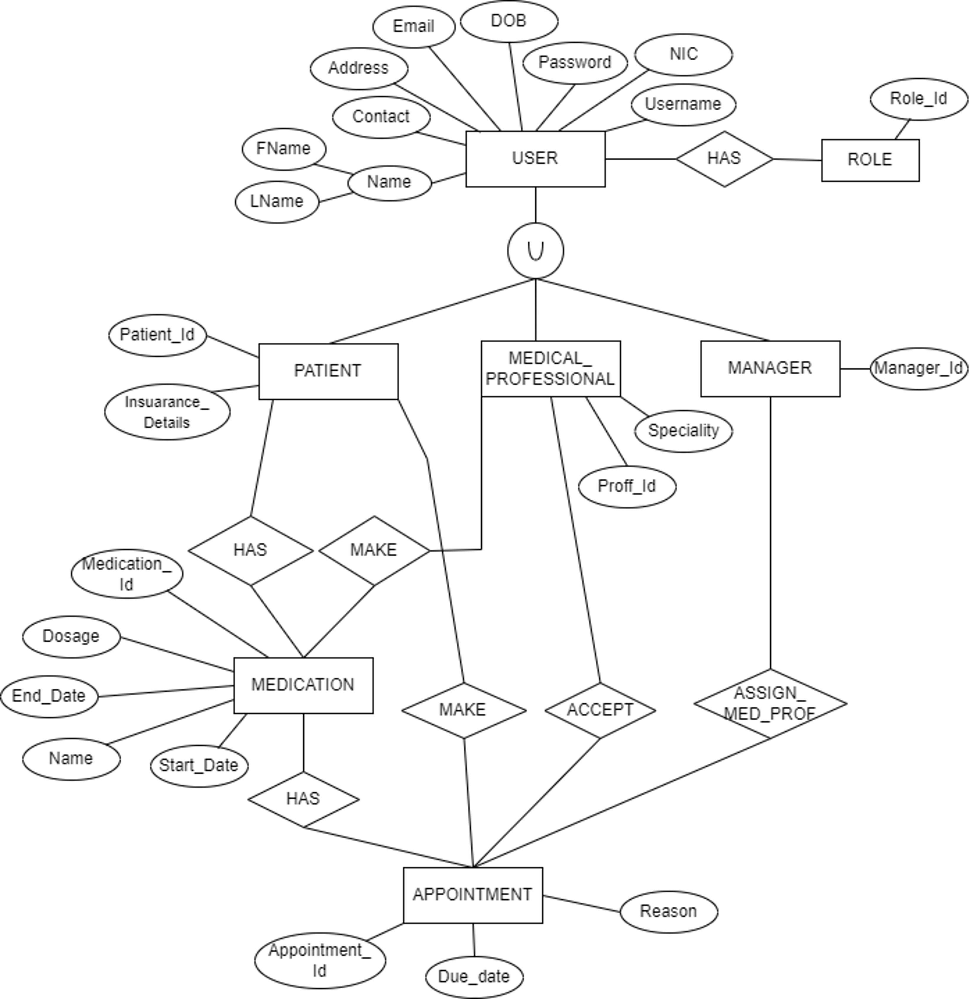
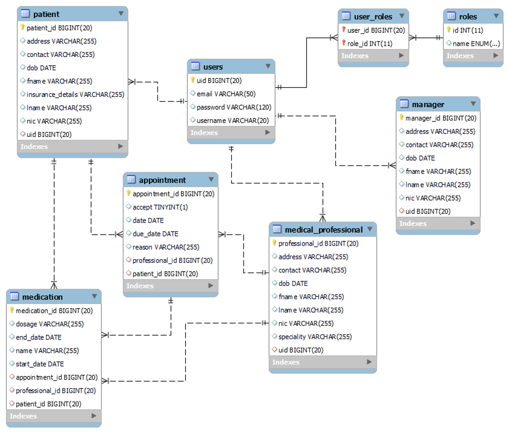
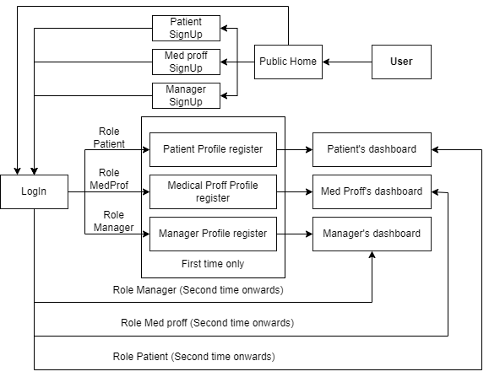
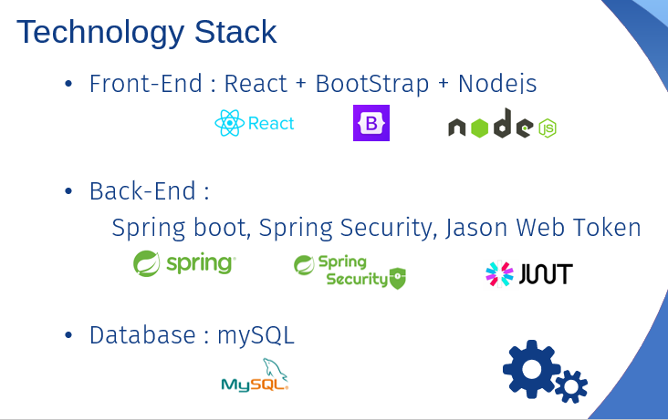

Our platform empowers clinics to efficiently handle appointments, medications, and vital medical information, all in one centralized and  secure location. Patients can easily schedule appointments, access their medical history, and receive timely reminders, fostering a sense of engagement and empowerment in their healthcare journey. LifeCare enables doctors to optimize their practice by providing them with a convenient interface to manage patient records, prescribe medications, and stay organized.

## EER Diagram

## Relational Mapping

## Control Flow

## Technologies

https://projects.ce.pdn.ac.lk/docs/how-to-add-a-project
